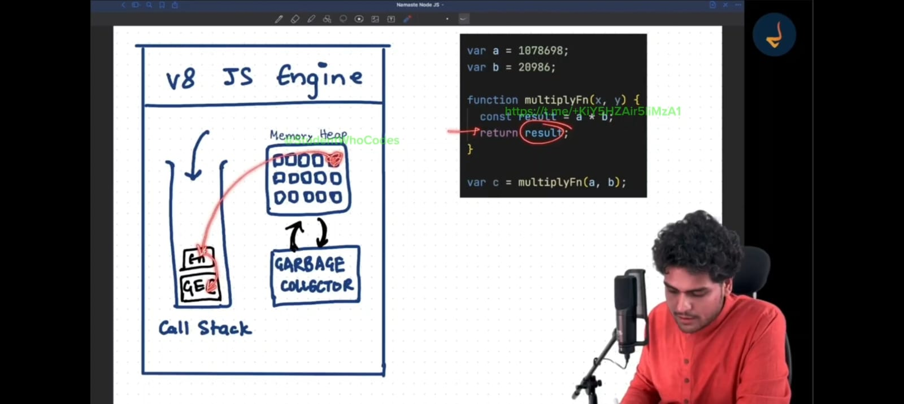
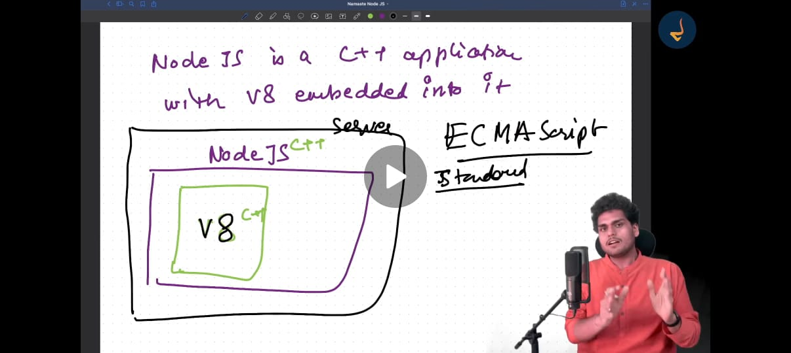
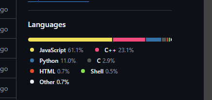
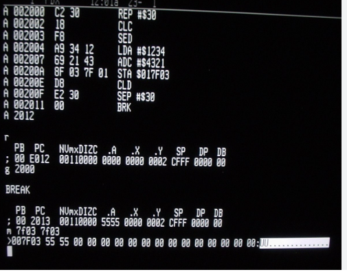
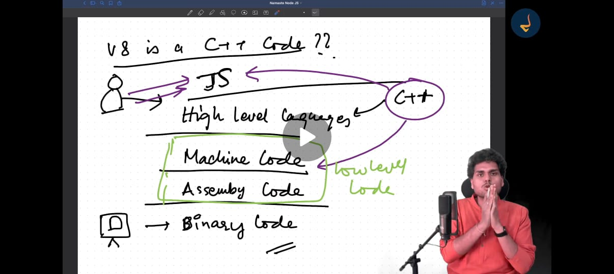

***Any Application That can be written in JS will eventually be written in JS*** - Jeff Atwood-2007 (Founder-StackOverflow)

# What is NODE JS
- Node Js is a Cross Platform,Open-source JS Runtime Environment that can run on windows,unix,linux,macOs and many More And It was built using Chrome's v8 Engine. Initially JS Was built to run only on Browser's but with Node we can run JS Outside Browser.
Js needs a JS Engine to Run and it can-not run without JS Engine.
Where-ever there is JS there is also a JS Engine to Run the Code.

 
- It was developed in 2009 by Ryan-Dahl.Initially when Ryan started development of Node he started it with SpiderMonkey which is also a JS Engine on FireFox.

For eg: Google Chrome ---> v8
Firefox ---> SpiderMonkey
Safari ----> JavaScriptCore
Edge ----> Chakra 
So all these browser's have there own JS Engine to Execute JS Code.

But after starting the development he decided to drop the idea of development with SpiderMonkey and then he started the Development with chrome's JS (v8) Engine due to its superior performance and design( Performance Optimization,Modern Features,Non-blocking I/O Philosophy
) and He never looked Back.
And there was also a company __(Joyent)__ which was also working on something similar so they asked and hired Ryan to work on this Development by funding his Development.

When Ryan has Developed Node JS he had named it Web Js But later he realized it's potential that it is bigger than web so he Re-named it as __Node JS__.

# Reason Why Node JS Was Created:-
Initially to create the servers there was this __APACHE__ HTTP Server and other servers and these servers were a blocking Server(***More understanding of this concept below What is Blocing Server etc.*** ).And Ryan Wanted to create a non Blocking server and that's why he created Node JS. The __Advantage__ of Non-Blocking servers is It Can handle multiple Requests With Lesser Number of threads.

# NPM - 
In 2010 when Node Js was also Being Developed So a Developer from Joyent created NPM which is a package manager for Node. Which is a Registry where we can add a package(for eg: Package for Images,Package for Time and Date,Package of Servers etc.). And all these packages are available on npm and it was very significant step in the success of Node Js. Node Js would not be as successful as it is now without _NPM_(It's Pacakage Manager).

# Windows Support :-
Initially when Node JS was built It was only built for Linux and MacOs and in 2011 the support for Windows also 
Came up which was lead by Joyent and Microsoft making it much more accessible with much bigger Developer's 
Community.

# 2012
In _2012_ Ryan left the project (handling Node Js) and handed it to _Issac_ (A developer in joyent) and
after he Left The pace of Development of Node JS Become very Slow. 
- So In 2014 a developer named Fedor created the fork of Node Js named _IO.js_ as Joyent was limiting the Releases of Node and the Development process also become Very Slow and it was not Actively managed.So some people started using and Maintaining _IO.js_.
- So In _2015_(Sep) These 2 different forks _Node Js_ and _IO Js_ Got merged and there was one committee formed which is Known as Actual
Node JS that we use.
- In _2019_ Again there is one community known as JS foundation and Node Js foundation were again Merged to Create a Open JS Foundation commmitte
 which took control over Node Js which now maintains Node Js.

# Node Js ON the Server
- A server is a remote or local computer (or a virtual machine) that runs software and services to handle client requests over a network. It processes requests, hosts websites, serves APIs, manages databases, and performs other computing tasks
**Exapmple**
- A web server (like Apache, Nginx, or Express.js) serves websites.
- A database server (like MongoDB, PostgreSQL) manages databases.
- A file server stores and shares files over a network

For Eg: When a client using  Internet write's Google.com and Hit's enter in Browser So Now Every Domain will Map to an IP (112.625.123.8) address of the server where that site is hosted. So now this IP points to the server and server will serve the info which client has Requested.

# CHROME JS Engine(V8)
- Chrome's JavaScript engine is called V8. It's a high-performance engine that compiles JavaScript And it is written in C++.
To Confirm this go-to Browser and Search __v8 Github__ if you click on the first link of v8 ( https://github.com/v8/v8 )
and when you scroll down to Language Section you will that 78% of code is written in C++ for JS Engine. And Other Languages are also there like JS itself, pyhton, TypeScript etc.

We can also find the Reference for this at v8 Engines Official Website (https://v8.dev/)
***V8 can be embedded in Any C++ Application*** - So the creator of Node just embedded this v8 engine into a c++ Application and we call it Node Js.

Node Js has V8 Engine + Other __SuperPowers__(will continue Below later) which are API's On server.So V8 Engine's only Job is to execute JS on server. But to get more Features Node JS has other powers along with v8 which is why it's called JS RunTime.

# Why v8 is a C++ Code.
Our Compouters Understand's Binary Code (0 and 1's) and on top of Binary code we have Assembly Code and on Top of Assembly code we have Machine Code and on Top of Machine Code we have High Level Code (C++ etc.) On Top of high level language we have JS. so this JS engine takes this JS code and converts it into Machine Code (which is also known as low Level Code).
 

 And this is the JOB of our JS engine to convert the Code into Machine Understandable Code :
 

If we go-to Repository of Node we will find v8 as an Dependency of Node. (https://github.com/nodejs/node/tree/main/deps/v8)

# ECMA Script -->
- ECMA Script is a Standard for JavaScript. It is a specification that defines the syntax and semantics of the JavaScript language. It is maintained by the ECMA International organization.It Basically defines the Rules that JS syntax uses. 
__For Eg__: If we say that (===) operator means strictly equal to operator so this rule was made by ECMA Script Standard Organizantion.
And Js Engine Follows these Standards while executing the code.
[ECMA SCRIPT Official Documentation Site](https://tc39.es/ecma262/)

# NODE REPL(Read,Evaluate,Print & LOOP)
The Quickest way to run our code in our machine after installing Node is to go to terminal and Type Node there and hit enter it will open Node REPL(command Line for Node). It first Reads the code, Then Evaluates the code then it Print's the output and then start Again (i.e Loop)
Inside the REPL we can write any JS code. 

# Global Objects in Node-JS
Global is an one of the superpowers which is given to us by Node-Js.(It is not given us by v8 Engine)
Global Objects are the Objects that are available in all Scope and we can can use them anywhere in Project. They provide core functionalities without needed to require them explicitly in our Code.

<ref *1> Object [global] {
  global: [Circular *1],formation.
  clearImmediate: [Function: clearImmediate],
  setImmediate: [Function: setImmediate] {
    [Symbol(nodejs.util.promisify.custom)]: [Getter]
  },
  clearInterval: [Function: clearInterval],
  clearTimeout: [Function: clearTimeout],
  setInterval: [Function: setInterval],
  setTimeout: [Function: setTimeout] {
    [Symbol(nodejs.util.promisify.custom)]: [Getter]
  },
  queueMicrotask: [Function: queueMicrotask],
  structuredClone: [Function: structuredClone],
  atob: [Getter/Setter],
  btoa: [Getter/Setter],
  performance: [Getter/Setter],
  fetch: [Function: fetch],
  crypto: [Getter]
}

Global Objects and functions In Node.js
Window,this,self,frames all these keywords refer to Global Object in Browser's.
__globalThis__ Points to Global Object in all the Environments(Node JS, Chrome,Safari,Edge.)As different Environments had different keywords which point to global Objet in different environments. In 2020 ECMA Finalized __globalThis__ as the Object which will refer to global Object in all the Envrionments.

# Node.js Modules 
Any piece of code written in a separate file is a module.Each file in Node.js acts as a module by default. To enable interaction between modules, we use module.exports and __require()__ (CommonJS) or export and import (ES Modules) for exporting and importing functionality.
To make two modules work together, we use module.exports to expose functionality and require (CommonJS) or import (ES Modules) to use them in other files.

require function is available to us anywhere in our Node Js Code. Whenever we run any program in Node Js require is always there just like global is always there similarly require is also there.So we can just require any file/module into another.

# Node.js Modules System
We can-not access private variables or functions which are there in a module in any other without the module in which they are present exporting them. 
Modules protects their variables and functions from leaking.So to access any function or variables into another module we cannot just require 
them in another file and use them. To use them into another module we have to first export our variables and functions.
For eg: In our sum.js we have a function to calculate the sum of 2 numbers but we cannot import the file sum.js in our app.js
and use calcuolateSum function directly instead to use them first we have to export them in our sum module then we can import them in our
app.js file
For eg:
function calculateSum(a,b){
    const sum =a+b;
console.log(sum)
}

module.exports =calculateSum; ***First we have to export the function calculateSum in our sum.js file then we have to import it in the file we want to use it  ***
for eg:- 
const calculateSum =require('./sum.js') //***Here we have imported the function calculate sum in our app.js and then we can use this function to calculate sum in the app.js file ***

If we had multiple things to import in our Sum.js file like a variable x and a function calculateSum then we can export it as an Object.
for eg:-
var a=120;
function calculateSum(a,b){
    const sum =a+b;
    console.log(sum)
    }
module.exports={
    a:a,
    calculateSum:calculateSum
}//***when exporting multiple things at once we can export it as an Object.***

Now again to use this export in our app.js we can import it as 
const obj = require("./sum.js") ***As we have exported our variables snd functions as an Object we can access them in an Object***
for Eg:
***we can use them as***
obj.calculateSum(a,b) and also 
obj.a

we can also do console.log(obj.x)

We Can also directly destructure our objects directly while exporting and then we use them without writing Obj
for eg:- const {calculateSum,x} =require("./sum.js") // imported them directly in our app.js with Object destructuring

adn then we can use them without obj
calculateSum(a,b) and also 
we can also do console.log(x)

We can also directly export our function and variables directly withot as a key value Pair.
module.exports={
    a
    calculateSum
}

while importing a module using requires we can avoid writing the extension for the file as It will assume that it is (.js) file
for eg: require("./sum") // ***here we do not need to write the extension.***

These type Of Import and Export of modules is Known as Common JS Modules(CEJS). There is one more type of import and export which is known as ES Modules
By default In our app we have commonjs modules in but when we want to use ES Modules we have to create a __package.json__ file and in that we have to specify type as module;
{
    type:"module"
} 

then we can use import and export directly instead of using require and module.exports
for eg: for importing we use
import {x,calculateSum} from "./sum.js"
and for exporting we can use export var x=10 or export function (){}

When commonJs requires the modules in a synchronous way means if we require any file then unless and until the file is not loaded it will not move to next file.
But ES Modules are loaded in an asynchronous way means if we import any file then it will not wait
for the file to be loaded it will move to next file and it will load the file in the
background.
Code in common JS modules Run in Non-strict Mode but in ES modules code runs in Strict Mode.

## Module exports
while exporting functions and variables in our modules when we write module.expports ={x,calculateSum}
so here the module.exports is a an empty object and we can check this by using a __console.log(module.exports)__
and it will return an empty object.

so while exporting we can also write like
***module.exports.x=x***
***module.exports.calculateSum=calculateSum***

## NODE - JS  Practice From Basics

Created a Node Js Server which listens on port (3000)
"const http = require("http");

const server = http.createServer((req, res) => {
  if (req.url === "/getData") {
    res.end("Data Chahi Re 🤨");
    return;
  } else {
    res.end("Sun raha hu be: :|");
  }
});
server.listen(3000);

Here first installed the node js and imported the built in http module from node and then I Created an http server using __http.createserver()__ method available on http module I created a server and which takes a callBack function with 2 parameters 
req (request) → contains details about the incoming request (like the URL).
res (response) → used to send a response back to the client

Inside the Callback function i Checked if requested url is "/getData" if that is true then sent a response using native node method res.end
"Data chahi Re" Other wise if requested url is not that then sent a response "Sun Raha hu be :|" 
- Finally i started my server on port 3000 using __server.listen(3000)__ to listen to incoming http responses.

